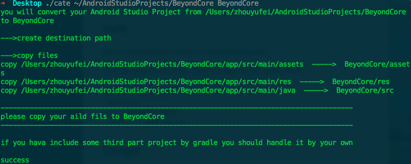

##cate
__c__onvert __a__ndroid studio project __t__o __e__clipse workspace

可以将Android Studio中的工程转为Eclipse可以导入的项目结构

```
cate	英[keɪt]
美[keɪt]
n.	<古>佳肴，美食;
[其他]	复数：cates

```

##Usage
```
usage: cate [Android Studio Project Path] [Destination Path]
```

##Example

